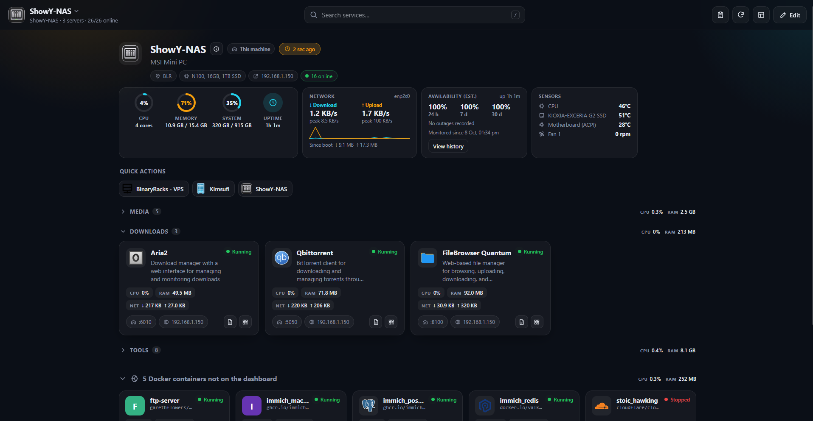
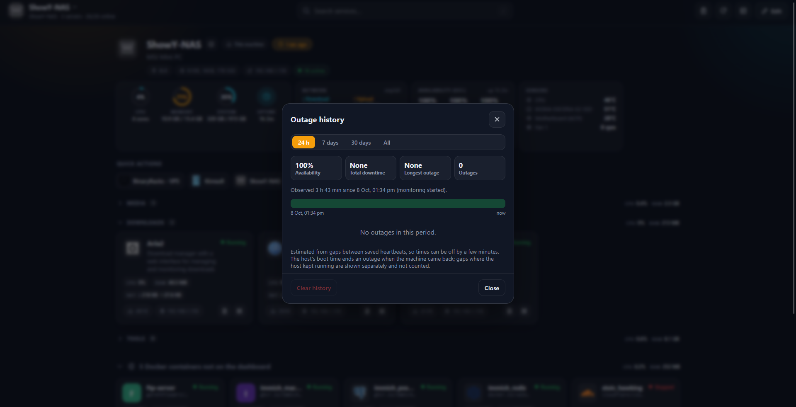
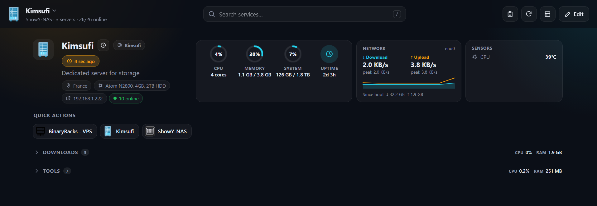
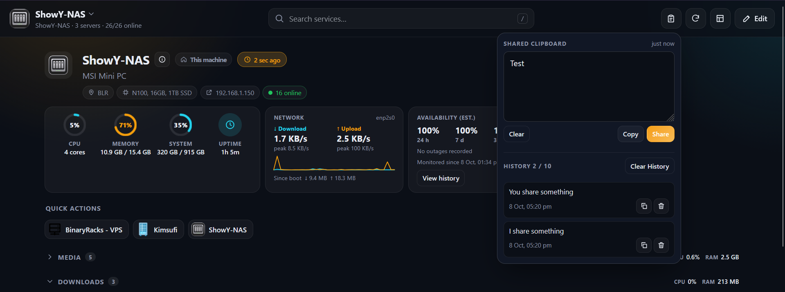
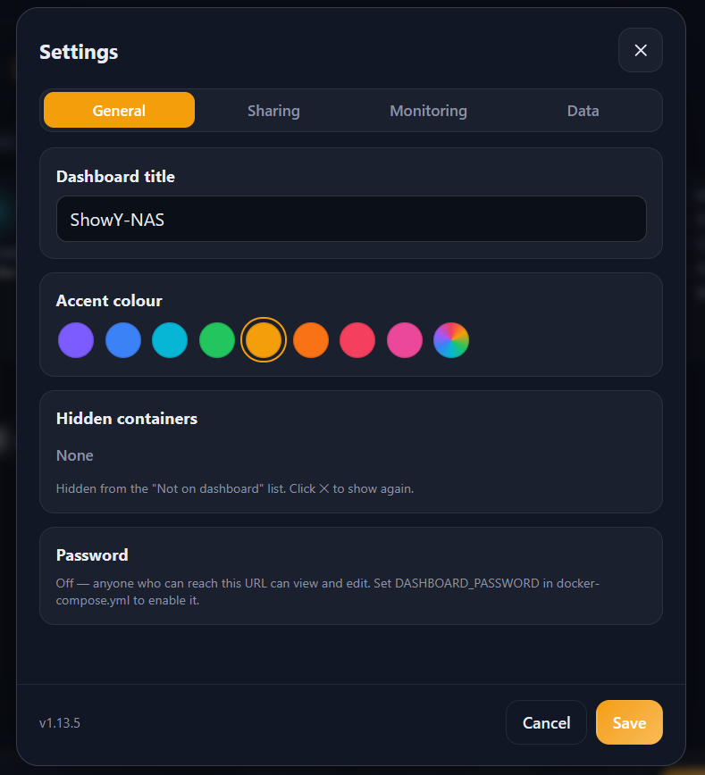

<div align="center">

# ShowY Dashboard

**Your homelab, at a glance.**

A lightweight, self-hosted dashboard for organizing services, monitoring Docker containers, and keeping an eye on multiple servers — all from one place.

   

</div>



## Why ShowY Dashboard?

ShowY Dashboard is a small Node.js app with a plain HTML/CSS/JavaScript frontend. **No database, no frontend build step, and no npm packages.** Configure everything from your browser and keep your data in local JSON files. The original setup reports approximately **50 MB idle RAM usage**, although actual usage depends on your environment.

- **One home for your services:** group, pin, search, and reorder links, with status checks and QR codes.
- **Docker visibility:** automatically match services to containers and see their state, CPU, memory, and network activity.
- **Host monitoring:** live CPU, memory, disk, network, temperature, fan, and uptime information on supported Linux hosts.
- **Multiple machines:** connect remote dashboard instances to see their servers and stats together.
- **Availability history:** track estimated host availability and past outages without an external monitoring service.
- **Everyday shortcuts:** shared clipboard, quick links, and copyable commands.
- **Personalized experience:** multiple layouts, themes, accent colors, and installable PWA support.

## Screenshots

### Dashboard overview


### Server monitoring and Docker containers



### Remote dashboards



### Shared clipboard



### Settings and customization



## Features in detail

| Area | What you get |
| --- | --- |
| **Service directory** | Icons, descriptions, local and alternate URLs, groups, drag-and-drop sorting, favorites, and notes |
| **Health checks** | Up/down status, including failed HTTP responses such as 404 and server errors |
| **Docker integration** | Automatic container matching, state, CPU/memory/network usage, and a list of containers not yet on the dashboard |
| **Server stats** | CPU, RAM, disks, uptime, network speed/history, temperatures, and fans |
| **Server information** | Hostname, OS, kernel, CPU, IP addresses, network interfaces, and Docker engine details |
| **Remote dashboards** | Read-only views of other dashboard instances, with configurable refresh and stale/unreachable indicators |
| **Outage tracking** | Estimated 24-hour, 7-day, and 30-day availability plus outage history |
| **Shared clipboard** | Text/link sharing between devices, persistent history, configurable entry count, and copy/delete actions |
| **Quick actions** | Open a saved link or copy saved text with one click |
| **Customization** | Card, compact, and list layouts; auto/light/dark themes; accent colors; searchable icons and icon caching |
| **Convenience** | Search (`/` shortcut), QR codes, PWA installation, JSON export/import, and optional password protection |

Icons can come from [dashboard-icons](https://github.com/homarr-labs/dashboard-icons), an emoji, or a custom image URL. Saved icons are cached locally for faster loading.

## Quick start (Docker)

**Requirements:** Linux, Docker, and Docker Compose.

1. Clone the repository:

   ```bash
   git clone https://github.com/shirishsaxena/ShowY-Dashboard.git
   cd ShowY-Dashboard
   ```

2. Review `docker-compose.yml`. Change the published port if `8011` is in use; optionally set `DASHBOARD_PASSWORD` and add disk mounts.
3. Build and start:

   ```bash
   docker compose up -d --build
   ```

4. Open **`http://YOUR-SERVER-IP:8011`**.
5. Select **Edit**, add a server, mark the local host as **This machine**, then add services manually or from **Not on dashboard**.

Your configuration is persisted in `./data` and survives container rebuilds, as long as that directory is retained.

### Update

Pull the latest code and rebuild, keeping your `data` directory:

```bash
git pull
docker compose up -d --build
```

### Additional disk monitoring

Add read-only disk mounts under `volumes` in `docker-compose.yml`, for example:

```yaml
volumes:
  - /mnt/hdd:/disks/HDD:ro
```

For SATA HDD/SSD temperatures on Linux, load the host's `drivetemp` module:

```bash
echo drivetemp | sudo tee /etc/modules-load.d/drivetemp.conf
sudo modprobe drivetemp
```

## Public VPS deployment (HTTPS)

The included `docker-compose.vps.yml` runs the dashboard behind [Caddy](https://caddyserver.com), which obtains and renews HTTPS certificates automatically.

1. Point your domain's DNS **A record** to your VPS and allow inbound ports **80** and **443**.
2. Configure the environment:

   ```bash
   cp .env.example .env
   nano .env
   ```

   Set `DOMAIN` and a strong `DASHBOARD_PASSWORD`.
3. Start the VPS stack:

   ```bash
   docker compose -f docker-compose.vps.yml up -d --build
   ```

4. Open `https://your-domain`.

The VPS configuration requires a password and places the whole dashboard behind the login screen. For updates, use the same Compose command with `-f docker-compose.vps.yml`.

## Connect multiple dashboards

Install an instance on each machine. Each instance monitors its own host and services; a main dashboard can display other instances as read-only remote servers.

1. On the remote instance, go to **Edit → Settings → Share this dashboard → Turn on**, then copy its share token.
2. On your main instance, go to **Settings → Remote dashboards** and add the remote URL and token.
3. Select the remote machine from the server switcher to see its services, host stats, and Docker usage.

Remote information is fetched server-to-server. The remote must be reachable from the dashboard server (for example, over your LAN or a VPN). **Use HTTPS across the public internet** to protect tokens in transit. Remote refresh is configurable (default: 10 seconds), and disconnected remotes are marked stale or unreachable while retaining their last known data. Share tokens grant read access to the source dashboard, not edit access, and are not forwarded to the browser.

Alternatively, define remotes in your Compose environment:

```yaml
environment:
  SHARE_TOKEN: "replace-with-a-random-token-at-least-16-characters"
  REMOTE_DASHBOARDS: |
    VPS | https://dash.example.com | token-of-the-vps
    NAS | http://192.168.1.20:8011 | token-of-the-nas
```

You can generate a token with `openssl rand -hex 24`. Environment-defined remotes appear as fixed entries in Settings; UI-defined remotes are kept alongside them.

## Outage tracking

ShowY Dashboard records a heartbeat for its own machine every **1, 5, or 10 minutes** (configurable). On startup, it checks gaps against a **5, 10, 15, or 30-minute** threshold (default: 10 minutes).

- If the host rebooted, the gap is recorded as a host outage.
- If the host stayed up but the dashboard stopped, the gap is recorded separately and **does not count as host downtime**.
- Late heartbeats caused by a suspended or paused host can also register as outages.

The dashboard reports estimated availability over **24 hours, 7 days, and 30 days** based on the period actually monitored. Accuracy is limited by heartbeat frequency and the reliability of host uptime reporting. Configure or clear records in **Settings → Outage tracking**. This is **not** a substitute for independent, external uptime monitoring.

## Password protection

| Mode | Configuration | Access |
| --- | --- | --- |
| No password (default) | Leave `DASHBOARD_PASSWORD` empty | Anyone who can reach the dashboard can view and edit |
| Edit-only lock | Set `DASHBOARD_PASSWORD` and `DASHBOARD_LOCK_VIEW=false` | Everyone can view; editing and clipboard sharing require login |
| Full lock | Set `DASHBOARD_PASSWORD` and keep `DASHBOARD_LOCK_VIEW=true` | Login required to view anything |

Use **full lock and HTTPS** when exposing the dashboard to the internet. Notes, quick-action text, and clipboard entries may be visible to anyone with view access: **do not store passwords or secrets there**.

## Configuration

Set these in `docker-compose.yml` under `environment`. The full range of monitoring timings is also configurable in **Settings → Monitoring**; environment values override and lock the corresponding UI controls.

| Variable | Default | Purpose |
| --- | --- | --- |
| `DASHBOARD_PASSWORD` | Empty | Optional dashboard password |
| `DASHBOARD_LOCK_VIEW` | `true` | Require login to view when a password is configured |
| `PORT` | `8080` | Internal HTTP port |
| `DATA_DIR` | `./data` (`/data` in Docker) | Persistent data directory |
| `HOST_STATS_INTERVAL` | `5` | Host stats refresh interval, seconds; `0` disables |
| `CONTAINER_STATS_INTERVAL` | `30` | Container usage refresh interval, seconds; `0` disables |
| `SHARE_TOKEN` | Empty | Fixed remote-sharing token (at least 16 characters) |
| `REMOTE_DASHBOARDS` | Empty | Remote definitions, one `Name \| URL \| token` per line |
| `REMOTE_REFRESH_INTERVAL` | UI setting (10 s default) | Remote refresh frequency |
| `DOCKER_REFRESH_INTERVAL` | `30` | Docker status refresh, seconds |
| `HEALTH_REFRESH_INTERVAL` | `60` | Service status and clipboard refresh, seconds |
| `HEALTH_TIMEOUT` | `6` | Per-service check timeout, seconds |
| `HEALTH_CACHE` | `45` | Service check cache duration, seconds |
| `LOCAL_STALE_AFTER` | `90` | When local data is marked stale, seconds |
| `DISKS_DIR` | `/disks` | Root of mounted disks shown in stats |
| `HOST_PROC` | `/host/proc` | Mounted host `/proc` for network information |
| `DOCKER_SOCKET` | `/var/run/docker.sock` | Docker API socket |
| `PUBLIC_IP_URL` | `https://api.ipify.org` | Optional public IP lookup service |
| `TRUST_PROXY` | `false` | Trust reverse-proxy visitor IPs; only enable when direct access is blocked |
| `SESSION_DAYS` | `30` | Login session lifetime in days |
| `LOGIN_MAX_FAILURES` | `5` | Failed login attempts before lockout |
| `LOGIN_LOCKOUT` | `60` | Login lockout duration, seconds |

Additional tuning options include `REFRESH_MIN_GAP`, `HEALTH_PARALLEL`, `REMOTE_TIMEOUT`, `LOAD_TIMEOUT`, and `DOCKER_PARALLEL`. See **Settings → Monitoring** for the adjustable values.

## Run without Docker

Requires **Node.js 18+**:

```bash
node server.js
```

Visit `http://localhost:8080`. Basic dashboard features work on Windows and macOS; Docker matching and Linux host network statistics require suitable Linux host access and Docker socket access.

## Data and backups

Everything lives in the `data/` directory:

| Path | Contents |
| --- | --- |
| `config.json` | Servers, services, groups, quick actions, and settings |
| `clipboard.json` | Shared clipboard history |
| `remotes.json` | Sharing tokens and remote connections |
| `availability.json` | Heartbeats and outage history |
| `serverinfo.json` | Public IP lookup preference |
| `tunables.json` | Monitoring timing preferences |
| `icons/` | Downloaded icon cache (safe to regenerate) |
| `session.key` | Session secret when authentication is enabled |

Use **Settings → Export JSON** to back up your dashboard configuration, or back up the entire `data/` directory to retain history and authentication-related state. **Do not commit `data/` to Git:** it may contain private URLs, clipboard content, and access tokens.

## Security considerations

- The app uses the Docker API for **read-only operations**; it does not expose container start/stop controls. **Note:** mounting `/var/run/docker.sock:ro` does *not* itself enforce read-only Docker API permissions. Treat access to the Docker socket as privileged and restrict who can access the dashboard host.
- Protect internet-facing installations with HTTPS, a strong password, and appropriate firewall rules.
- Sharing tokens grant access to remote host and service information; rotate or disable them when no longer needed.
- The included standard Compose configuration limits the container to **128 MB RAM and 0.5 CPU**.
- Icon downloads are validated and cached; SVGs are served with protections against script execution.

## Project structure

```text
ShowY-Dashboard/
├── server.js                 # HTTP server and API routes
├── lib/                      # Auth, Docker, host stats, health, remotes, etc.
├── public/                   # Frontend, icons, service worker
├── Dockerfile
├── docker-compose.yml        # Local/LAN deployment
├── docker-compose.vps.yml    # HTTPS VPS deployment with Caddy
├── Caddyfile
├── .env.example
├── VERSION                   # Version displayed in Settings
├── screenshots/              # Dashboard showcase images
└── data/                     # Runtime data (do not commit)
```

## License

Licensed under the [MIT License](LICENSE).

## Acknowledgments

Service icon search uses the community-maintained [Homarr dashboard-icons](https://github.com/homarr-labs/dashboard-icons) collection.

---

<div align="center">

**Built for homelabs, NAS setups, VPS instances, and anyone who wants a simpler view of their self-hosted services.**

</div>
